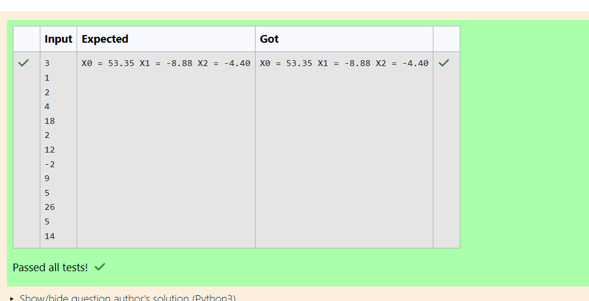

# Gaussian Elimination

## AIM:
To write a program to find the solution of a matrix using Gaussian Elimination.

## Equipments Required:
1. Hardware – PCs
2. Anaconda – Python 3.7 Installation / Moodle-Code Runner

## Algorithm
1. Define the package as scipy.linalg import lu.
2. Get input from user and print L and U matrix by 'print'
3. Define a package as "from scipy.linalg import lu_factor lu_solve" and create the
variable as "x" include the package in that variable.
4. print the variable 'X'
 

## Program:
```python

Program to find the solution of a matrix using Gaussian Elimination.
Developed by: Harisha S
RegisterNumber: 24900903
import numpy as np
import sys
n=int(input())
a=np.zeros((n,n+1))
x=np.zeros(n)
for i in range(n):
   for j in range(n+1):
      a[i][j]=float(input())
for i in range(n):
    if a[i][i]==0.0:
       sys.exist('Divide by zero detected!')
    for j in range(i+1,n):
        ratio=a[j][i]/a[i][i]
        for k in range(n+1):
            a[j][k]=a[j][k]- ratio* a[i][k]
x[n-1]=a [n-1] [n] / a [n-1] [n-1]
for i in range(n-2,-1,-1):
    x[i]=a[i][n]
    for j in range(i+1,n):
        x[i]=x[i] - a[i][j] *x[j]
    x[i]=x[i] / a[i][i]
for i in range(n):
    print('X%d = %0.2f '%(i,x [i]),end='')


```

## Output:



## Result:
Thus the program to find the solution of a matrix using Gaussian Elimination is written and verified using python programming.

